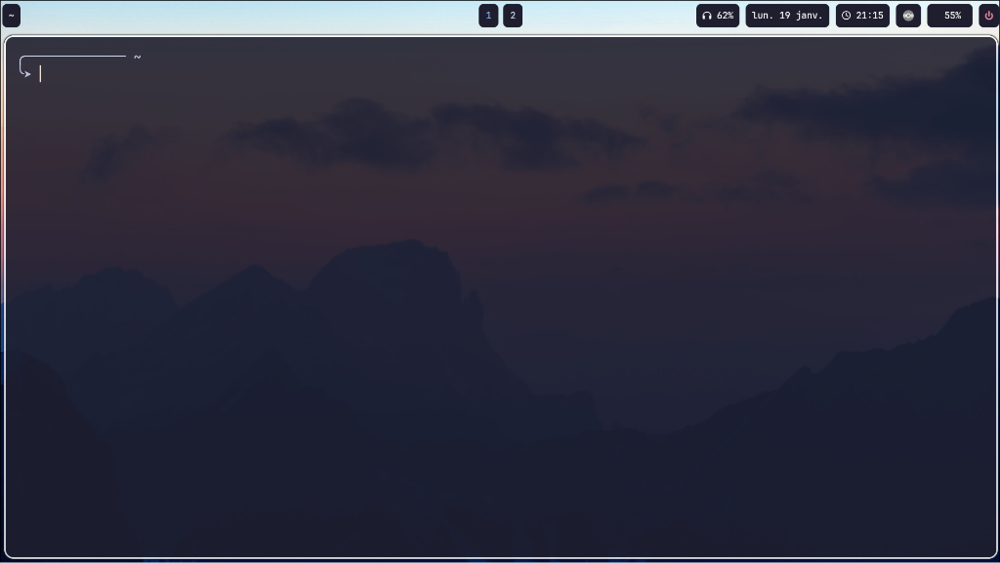

## 🐧 Fedora Dotfiles

Mon dépôt de configuration pour un environnement Hyprland complet sur Fedora.

### 🛠️ Installation & Restauration

Pour réinstaller cette configuration sur une nouvelle machine, cloner le dépôt, déplacer vous dedans et exécuter les liens symboliques suivants :

Bash
```
# Liens symboliques (Chemins absolus recommandés)
ln -sf ./hypr ~/.config/hypr
ln -sf ./waybar ~/.config/waybar
ln -sf ./kitty ~/.config/kitty
ln -sf ./nvim ~/.config/nvim
ln -sf ./zshrc ~/.zshrc
```

Note : L'option -sf permet d'écraser (force) un éventuel fichier déjà existant par le lien symbolique.

## Paquets à installer 

**Environment de bureau**

Bash
```
sudo dnf install hyprland waybar kitty hyprpaper hyprlock hypridle
```

**Développement et édition**

Bash
```
sudo dnf install neovim git lazygit python3-neovim nodejs
```

## Scripts 

Bash
```
cd ./scripts/cli2text/
npm install
```
## Screenshot

