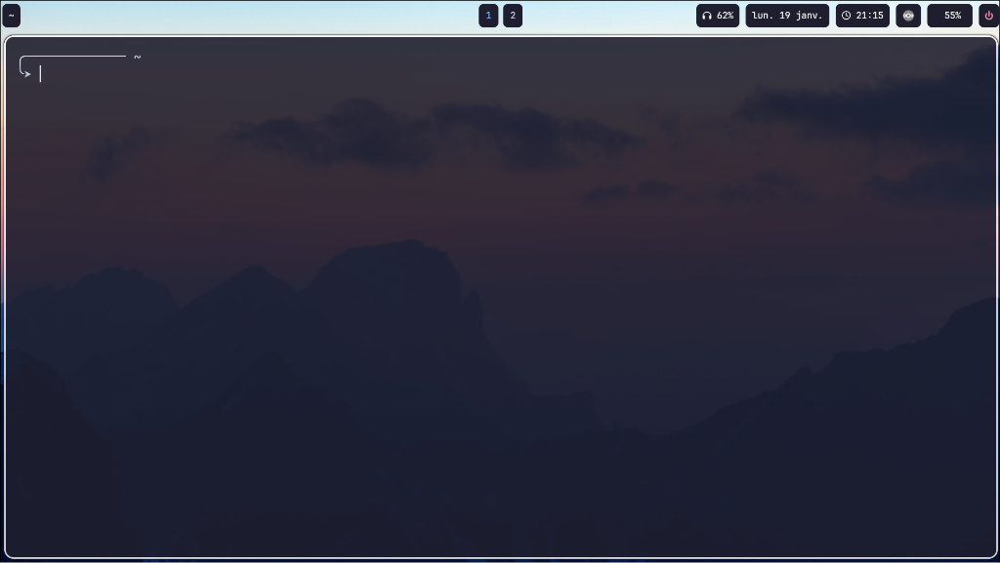

## 🐧 Dotfiles – Hyprland + Zsh

Configuration reproductible pour Hyprland sur **Void Linux** et **Fedora** avec gestion automatisée via GNU Stow.

### 🚀 Installation Rapide

#### Void Linux
```bash
git clone https://github.com/yourusername/dotfiles ~/.dotfiles
~/.dotfiles/scripts/install-void.sh
```

#### Fedora
```bash
git clone https://github.com/yourusername/dotfiles ~/.dotfiles
~/.dotfiles/scripts/install-fedora.sh
```

Les scripts gèrent automatiquement :
- Installation des dépendances système (Hyprland, waybar, kitty, neovim, etc.)
- Configuration de Zsh avec Oh My Zsh, plugins et Powerlevel10k
- Installation de NVM et des outils CLI (eza, bat, zoxide)
- Téléchargement des fonts JetBrains Mono Nerd Font
- Création des liens symboliques via **GNU Stow**
- Activation des services et du thème SDDM Sugar

### 📋 Détails des Scripts

**`scripts/install-void.sh`** – Void Linux
- Active les repos `void-repo-nonfree`
- Installe les paquets via `xbps-install`
- Gère les services `runit` (sddm, dbus, pipewire)

**`scripts/install-fedora.sh`** – Fedora
- Active COPR `solopasha/hyprland` et RPM Fusion
- Installe les paquets via `dnf`
- Installe VS Code via Flatpak
- Gère les services `systemd`

**`scripts/common/stow.sh`** – Logique partagée
- Stow les configs dans `~/.config` avec `--target`
- Symlink `~/.zshrc`
- Copie le thème SDDM Sugar en tant que root

### ⚙️ Structure de Configuration

Les configurations sont organisées avec GNU Stow :
```
~/.dotfiles/
├── hypr/              → ~/.config/hypr
├── kitty/             → ~/.config/kitty
├── nvim/              → ~/.config/nvim
├── waybar/            → ~/.config/waybar
├── zsh/               → ~/.config/zsh
├── zshrc              → ~/.zshrc (symlink manuel)
└── ...
```

### 🔧 Installation Manuelle (Alternative)

Si tu préfères installer sans script :

```bash
# Cloner le repo
git clone https://github.com/yourusername/dotfiles ~/.dotfiles
cd ~/.dotfiles

# Installer GNU Stow
# Void: xbps-install stow
# Fedora: sudo dnf install stow

# Stow les configs
mkdir -p ~/.config
stow --target=~/.config hypr kitty nvim waybar wlogout fuzzel wofi yazi swaylock catpuccin wallpapers

# Symlink zshrc
ln -sf ~/.dotfiles/zshrc ~/.zshrc
```

### 📦 Paquets Inclus

- **WM** : hyprland, hyprlock, hypridle, hyprpaper
- **Status Bar** : waybar, wlogout
- **Terminal** : kitty
- **Editor** : neovim (LazyVim)
- **Shell** : zsh, oh-my-zsh, powerlevel10k
- **CLI Tools** : eza, bat, zoxide, nvm
- **Launchers** : fuzzel, wofi
- **File Manager** : yazi
- **Audio** : pipewire, wireplumber, pavucontrol
- **Screenshots** : grim, slurp, wl-clipboard
- **Fonts** : JetBrains Mono Nerd Font, Noto Fonts
- **Icons** : Papirus Dark, Adwaita
- **Login Manager** : SDDM avec thème Sugar
## Screenshot

